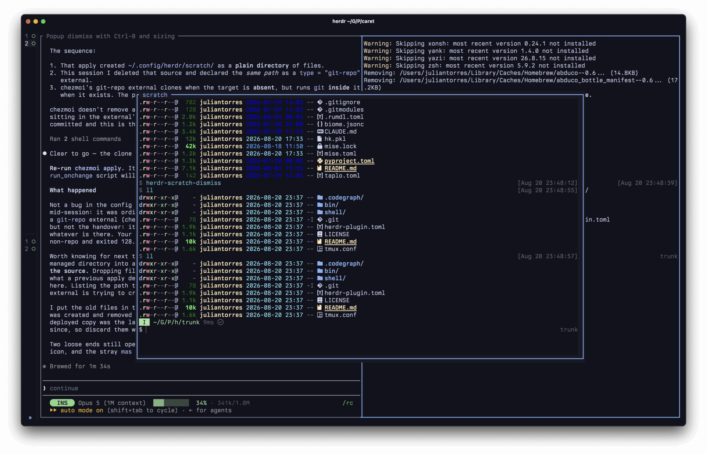

# 🐏 `herdr-scratch` 📜

A scratch shell for [herdr](https://herdr.dev), in a popup you toggle with one chord.



Press it and a shell opens over whatever you were doing, in that pane's directory.
Press it again and the popup goes away — but the shell does not. Start a dev server,
put the popup away, bring it back an hour later and it is still running, with the
scrollback exactly where you left it.

```
prefix + '     →  scratch shell opens, 70% of the screen, cwd of the pane you were in
prefix + '     →  popup closes; whatever is running keeps running
prefix + '     →  same shell, same output, same scroll position
```

macOS and Linux. Not Windows — it depends on tmux.

## Requirements

| | |
| --- | --- |
| **herdr** | 0.8.0+ (`herdr --version`). Earlier versions have no `plugin pane` command |
| **tmux** | `brew install tmux` / `apt install tmux`. It is what keeps the shell alive *and* the screen intact |
| **Go** | 1.21+, to compile the plugin binary at install time |
| **terminal-notifier** | optional, macOS only, for finish notifications |

## Install

```sh
herdr plugin install macintacos/herdr-scratch
```

That compiles the binary for you. herdr runs build commands during a GitHub install —
after confirmation, before it registers the plugin — so a failed build leaves nothing
half-installed.

Prefer to manage the checkout yourself? `herdr plugin link` deliberately leaves a local
directory alone, which means it does **not** build. Do that once yourself:

```sh
git clone https://github.com/macintacos/herdr-scratch ~/.config/herdr/scratch
cd ~/.config/herdr/scratch && go build -o bin/herdr-scratch .
herdr plugin link ~/.config/herdr/scratch
```

Installing does not bind anything. One step remains.

### Bind a key

In `~/.config/herdr/config.toml`, alongside any bindings you already have:

```toml
[[keys.command]]
key         = "prefix+'"
type        = "plugin_action"
command     = "user.scratch.toggle"
description = "scratch shell"
```

Then `herdr server reload-config` (start herdr first if it is not running).

`prefix` means whatever your herdr prefix key already is — `ctrl+b` unless you changed it.
Use any key you like in place of `'`.

This names an **action**, not a path, so it keeps working wherever herdr put the plugin.

What you cannot use is `type = "popup"`. A popup binding can only ever *open* one — press
it again and herdr answers "popup already open", so it never toggles.

**That is the whole setup.** You do not touch your shell config: the popup starts the
shell, so it loads its own key bindings.

## Using it

Inside the scratch popup:

| key | mode | what it does |
| --- | --- | --- |
| `q` | vi normal mode | writes out `herdr-scratch-dismiss` and runs it |
| `ctrl+b` `'` | any mode | dismisses immediately, no prompt needed |

`q` is for when you are sitting at a prompt. The chord is for when something is running and
there is no prompt to type at — it is the same chord that opened the popup, so it matches
the muscle memory, just answered by fish instead of herdr.

**Why the popup needs its own keys at all.** A herdr popup, per the herdr docs, "receives
all terminal input, including Escape, until its command exits." Your prefix key does not
reach herdr while a popup is up. So the chord opens the popup but cannot close it — only
something running *inside* it can.

### Shells other than fish

Only fish is wired up automatically, through `fish --init-command`. bash and zsh have no
equivalent that does not involve displacing your own rc file, so they are left untouched
and you bind things yourself. `herdr-scratch dismiss` is the command to bind — but **keep
the guard**, or you will bind the chord in every shell you open:

```bash
# bash — ctrl+b then '  (\047 is the apostrophe, which avoids quoting trouble)
if [ -n "${HERDR_SCRATCH_ROOT:-}" ]; then
    bind -x '"\C-b\047": "$HERDR_SCRATCH_ROOT/bin/herdr-scratch" dismiss'
fi
```

```zsh
# zsh — ctrl+b then '
if [[ -n ${HERDR_SCRATCH_ROOT:-} ]]; then
    herdr-scratch-dismiss() { "$HERDR_SCRATCH_ROOT/bin/herdr-scratch" dismiss }
    zle -N herdr-scratch-dismiss
    bindkey "^b'" herdr-scratch-dismiss
fi
```

There is no bash or zsh equivalent of the bare `q` binding — it relies on fish's vi mode
having a distinct command mode to bind into. In zsh you could get close with
`bindkey -M vicmd q herdr-scratch-dismiss`. The notification hook is fish-only too, since
it hangs off `fish_postexec`.

**If you use fish's vi mode elsewhere, note the mode name.** Bindings go on `-M default`,
because `default` is what fish calls vi's normal mode. `bind -M normal …` is accepted
without error and then never fires, because it creates a mode fish never enters.

## Check it works

1. `<prefix>'` → a bordered popup titled **scratch** opens, in the pane's directory.
2. Run something long: `while true; do echo tick; sleep 1; done`
3. `<prefix>'` → popup closes.
4. `<prefix>'` → same popup, ticks still counting, scrollback intact.

If step 4 gives you a blank screen or a fresh prompt, see Troubleshooting.

## How it works

Three pieces, each solving one problem herdr leaves open.

**A plugin pane, not a popup keybinding.** Only a plugin pane carries a title, so the
border reads `scratch` rather than the literal `popup`. And because the binding invokes an
action, it can decide between opening and closing — which is what makes one chord toggle.

**A tmux session per pane.** This is what survives the close. Dismissing detaches the tmux
client, and that client is the process herdr spawned — so herdr tears the popup down on its
own, while the session and everything in it carry on. Reopening attaches a new client, and
tmux repaints the screen it kept.

It has to be tmux, or something else that emulates a terminal. abduco and dtach are smaller
and hold a process open just fine, but they only pipe bytes — they keep no screen, so
reattaching gives you a bare prompt and the previous output is gone. If you only need "the
process survives", they are enough. For "it comes back exactly as I left it", they are not.

The session is keyed on herdr's pane id, so each pane gets its own scratch shell starting in
that pane's directory. It runs on its own tmux socket (`-L herdr-scratch`) with its own
config, so it never touches a tmux you started yourself — and that config unbinds tmux's
prefix, which is otherwise `ctrl+b` and would eat the dismiss chord.

**Detach, not an API call.** Closing is a plain `tmux detach-client`, so the plugin needs no
socket client of its own — and it is a clean detach rather than herdr killing the client out
from under tmux.

## Notifications

Optional, macOS only, fish only, and silent unless `terminal-notifier` is installed.

```sh
brew install terminal-notifier
```

When a command finishes in a popup you are **not** looking at, you get a desktop
notification. The shell inside the popup keeps running while detached, so fish keeps firing
`fish_postexec` after every command — that is what notices. tmux reports zero attached
clients exactly when the popup is closed, so a popup you are watching stays quiet.

The notification wears **your terminal's icon**, via `-appIcon` and the bundle id macOS
publishes in `__CFBundleIdentifier`, which survives down through herdr and tmux into the
popup. So it follows whichever terminal is actually attached rather than being pinned to
one.

> Not `-sender`, which is the obvious flag for this and does not work: it asks
> terminal-notifier to post *as* another application, which needs a private bundle-id API
> that recent macOS no longer honours. The notification never arrives at all.

Commands shorter than 10 seconds are ignored. To change that, set the threshold in
milliseconds anywhere in your fish config:

```fish
set -g herdr_scratch_notify_after 30000   # 30 seconds
```

## Configuring

**Size** — `width` and `height` in `herdr-plugin.toml`. Terminal cells as numbers, or a
percentage string like `"70%"`. Omit both for herdr's default half-size popup.

**Sessions** — `tmux -L herdr-scratch ls` lists them, one per pane you have used it in.

They outlive the pane that created them. Close that herdr pane and its session keeps
running, but nothing will attach to it again: the next pane gets a new id, so it gets a new
session. Orphans sit there until you kill them or reboot. If you leave heavy things running
in scratch shells, check that list now and then.

## Uninstall

```sh
tmux -L herdr-scratch kill-server     # stop every scratch shell
herdr plugin uninstall user.scratch   # or: herdr plugin unlink user.scratch
```

Then delete the `[[keys.command]]` block from `config.toml` and `herdr server reload-config`.

## Troubleshooting

**The popup opens and closes immediately.** tmux failed to start, or the binary is missing.
If you linked a local checkout, `herdr plugin link` does not build — run
`go build -o bin/herdr-scratch .` in the plugin directory.

**The chord opens the popup but will not close it.** Check `HERDR_SCRATCH_ROOT` is set
inside the popup. If it is unset, this shell was not started by the plugin.

**`q` does nothing in normal mode.** Almost always a `bind -M normal` somewhere in your own
config, which never fires. Use `-M default`.

**Reopening gives a blank screen or a fresh prompt.** Whatever is running the session is not
tmux. Check the `command` in `herdr-plugin.toml`.

## Development

```sh
go build -o bin/herdr-scratch .   # the [[build]] command, by hand
go test ./...                     # the decision logic in internal/scratch
herdr plugin link "$PWD"          # point herdr at this checkout
```

`internal/scratch` holds the choices worth testing — session naming, resolving which pane a
binding fired from, which shell argv to launch, how the notification is assembled — kept
apart from the processes `cmd/` runs so they can be exercised directly.

## License

MIT
